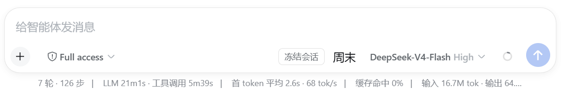

<p align="center">
  <strong>Barrière de session automatique aux heures de pointe : mode week-end + pause automatique en pointe + verdict bidimensionnel des sources officielles + gel au niveau session + relance automatique côté backend</strong>
</p>


<p align="center">
  <a href="README.en.md">English</a> · <a href="README.md">中文</a> · <a href="README.ja.md">日本語</a> · <a href="README.ko.md">한국어</a> · <strong>Français</strong> · <a href="README.de.md">Deutsch</a> · <a href="README.it.md">Italiano</a> · <a href="README.ru.md">Русский</a> · <a href="README.es.md">Español</a>
</p>
<p align="center">
  <a href="LICENSE"></a>
  
  
</p>

# dsh-session-guard

- [English README](./README.en.md)
- [中文 README](./README.md)
- [日本語 README](./README.ja.md)
- [한국어 README](./README.ko.md)
- [README en français](./README.fr.md)
- [README auf Deutsch](./README.de.md)
- [README in italiano](./README.it.md)
- [README en russe](./README.ru.md)
- [README en español](./README.es.md)
- [Installation guide](./INSTALL.md)
- [中文安装指南](./INSTALL.zh.md)
- [日本語インストールガイド](./INSTALL.ja.md)
- [한국어 설치 안내](./INSTALL.ko.md)
- [Guide d'installation en français](./INSTALL.fr.md)
- [Installationsanleitung auf Deutsch](./INSTALL.de.md)
- [Guida all'installazione in italiano](./INSTALL.it.md)
- [Руководство по установке на русском](./INSTALL.ru.md)
- [Guía de instalación en español](./INSTALL.es.md)
- [Changelog](./CHANGELOG.md)
- [日本語 changelog](./CHANGELOG.ja.md)
- [한국어 changelog](./CHANGELOG.ko.md)
- [Changelog en français](./CHANGELOG.fr.md)
- [Changelog auf Deutsch](./CHANGELOG.de.md)
- [Changelog in italiano](./CHANGELOG.it.md)
- [Changelog en russe](./CHANGELOG.ru.md)
- [Changelog en español](./CHANGELOG.es.md)

> **Note de compatibilité :** la v0.1.1 embarque déjà les dictionnaires japonais (`ja`) et coréen (`ko`), mais les versions officielles actuelles de DSH n'exposent que `zh` et `en` via `LocaleRuntime`. Sur un DSH d'origine, choisir `ja` ou `ko` échoue avec le message `locale "<id>" is not registered`. Il faudra attendre que le DSH officiel ajoute les identifiants de locale correspondants pour que cela fonctionne. Les utilisateurs avancés peuvent maintenir un fork de DSH pour l'étendre.

> **▼ Compatibilité des versions de DSH**
>
> | Version de DSH | Chargement | Enregistrement des réglages | Événements de session / barrière | Moitié client |
> | --- | --- | --- | --- | --- |
> | 0.1.0-rc.7 ~ 0.1.1-rc.x | ➖ hors de cette ligne (versions historiques antérieures à `legacy/0.1.2`) | `ctx.settings.register(ns, schema, { base })` | ✅ forme identique | ✅ aucun import de valeurs de plateforme |
> | 0.1.2-alpha.2+ / 0.1.2-rc.1 | ➖ hors de cette ligne → utilisez `legacy/0.1.2` (npm `@dsh-0.1.2`) | `register` conservé (avec en plus `installSection`) | ✅ forme identique | ✅ aucun import de valeurs de plateforme |
> | **0.2.0-rc.1+** | ✅ (**cette ligne**, dist-tag `dsh-0.2.0`, npm `4.0.0`) | déclaratif : les champs `.volatile()` du Config sont projetés en formulaires par l'hôte, `register` supprimé | ✅ événements lus via le double chemin `snapshotEvents()` | ✅ carte de réglages du client passée à `configForms` |
> | 0.1.7-rc.1+ | ✅ (branche `compat/0.1.7`, dist-tag `dsh-0.1.7`) | déclaratif : les champs `.volatile()` du Config sont projetés en formulaires par l'hôte, `register` supprimé | ✅ événements lus via le double chemin `snapshotEvents()` | ✅ carte de réglages du client passée à `configForms` |
> | 0.1.5-rc.2 | ✅ (branche `compat/0.1.5`, dist-tag `dsh-0.1.5`) | `register` toujours présent (espaces de noms sous forme de chaînes) | ✅ événements lus via le double chemin `snapshotEvents()` | ✅ |
>
> **Identité de cette ligne** : branche `compat/0.2.0`, numéro de version npm **`4.0.0`** (semver), dist-tag **`dsh-0.2.0`**.
> Les `engines.dsh` de `package.json` et de `dsh.plugin.json` ainsi que les quatre peers `@deepseek-ai/dsh-client-*`
> sont unifiés à `>=0.2.0-rc.1 <0.2.1-0` ; le plancher du peer `@deepseek-ai/cordis` est aligné sur le `^4.0.4` de la ligne hôte.
> Historiquement, le README utilisait « 2.x / 3.x » comme **surnoms de ligne** ; c'était une convention narrative, **pas des numéros de version téléchargeables depuis le registre** —
> référez-vous toujours aux versions npm `0.3.1` (ligne 0.1.2), `3.0.0`/`3.0.1` (ligne 0.1.5), `3.2.4` (ligne 0.1.7) et `4.0.0` (ligne 0.2.0).
>
> **Adaptation 0.2.0 (branche compat/0.2.0, npm 4.0.0)** :
> l'API de plugin utilisée par ce plugin (manifest/settings/HMR/slot/session V4) est entièrement compatible entre 0.2.0-rc.1 et 0.1.7 ;
> l'adaptation se réduit à un renouvellement des métadonnées (peer/engines/dist-tag/version 4.0.0). Corrections d'ingénierie alignées avec la base en même temps :
> ① `src/client/family-section.tsx` est intégré au contrôle de version (auparavant il n'existait que dans l'arborescence de travail locale, un checkout propre ne pouvait pas builder) ;
> ② la configuration eslint abandonne le `no-unused-vars` du core qui signalait à tort les paramètres de signatures de types TS, la baseline de lint est à nouveau toute verte ;
> ③ les gardes statiques de signature des chemins d'écriture v4 (`tests/source-kind.test.mjs`) entrent dans cette ligne avec la base ;
> ④ le peer `@deepseek-ai/cordis` est aligné sur `^4.0.4` (les paquets UI hôtes de 0.2.0-rc.1 déclarent `~4.0.4`, l'ancien `^4.0.1` n'entrait pas en conflit mais son plancher était trop ancien).
>
> **Emplacement des autres lignes** : pour un hôte DSH `0.1.2-rc.x`, utilisez la branche **`legacy/0.1.2`** (dist-tag npm
> `dsh-0.1.2`, version `0.3.1`). **`main` est gelé à `0.2.0-beta.1` et n'est pas la branche de publication de la ligne 0.1.2.**
> Pour un hôte DSH `0.1.0-rc.7` ~ `0.1.1-rc.x`, utilisez une version historique ≤ `0.1.2`.
> Définition officielle des sources de champs :
> `mine-dsh-plugins/improve-dsh-plugins/DSH-PLUGIN-VERSION-DISTRIBUTION-STRATEGY.md` §2.2.
>
> **Adaptation 0.1.5 (branche compat/0.1.5, npm 3.0.0)** :
> ① double chemin pour `agent.followup` — 0.1.5 transforme l'Inbox en projection en lecture seule de la boucle agent ; si `followup`
> n'existe plus, repli sur `agent.send`, et si ni l'un ni l'autre n'existe, dégradation en warn sans lever d'exception (filet de sécurité pour la reprise) ;
> ② les messages de reprise ajoutent `form: 'instructions'` à `source` (contrat ContextFormed de 0.1.5, ignoré par les anciennes versions) ;
> ③ `webServer.register` est enveloppé dans un try/catch : un échec d'enregistrement se contente de journaliser sans faire tomber le chargement du plugin hôte ;
> ④ 0.1.5 supprime l'accesseur tableau `session.events`, la lecture des événements passe par `snapshotEvents()` comme chemin principal +
> repli sur l'ancien tableau (n'affecte que les deux chemins auxiliaires `findToolOutcome` / `lastUserPrompt`, le filtrage par type d'événement restant inchangé).
> Il a été vérifié que le contrat `WebRoute` de 0.1.5 (exact/prefix + SSE) est inchangé : côté client,
> `fetch('/session-guard/...')` n'a pas besoin du préfixe `/api`.
> Le tableau de compatibilité ci-dessous couvre deux générations d'API (0.1.1 / 0.1.2) ; cette ligne ne revendique que la ligne 0.1.5.
> `session/event`, `agent.cancel`, `goals.pause`,
> `agent.followup`, `commands.register`, `timer.interval`, `webServer.register`,
> `agent/request`, `llm.listConfigurableProviders`, `settings.register/get` ont des signatures
> identiques entre `dsh-v0.1.1-rc.2` et `dsh-v0.1.2-rc.1` (cette ligne a vérifié jusqu'à `dsh-v0.1.5-rc.2`) ;
> la seule double lecture nécessaire concerne la forme de l'identifiant d'appel enregistré par `tool/result` (`content[].toolCallId` en priorité,
> `source.callId` en repli), extraite vers `src/tool-call-id.js` avec tests unitaires — les deux formes peuvent apparaître dans les journaux de relecture des deux versions.
> À partir de 0.1.5, l'accesseur tableau `session.events` est supprimé ; cette ligne lit via `snapshotEvents()` (repli sur l'ancien tableau conservé),
> ce qui n'affecte que les deux chemins auxiliaires `findToolOutcome` / `lastUserPrompt`.
> L'événement `model/selection` n'existe **qu'à partir de 0.1.2** et ne sert qu'à accélérer les changements de modèle, avec détection de fonctionnalité obligatoire ; la surface de réglages n'utilise que
> l'intersection `register` + `get` (jamais `installSection` / le `installSettingsSection` supprimé).
> Script garde-fou contre la dérive : `tools/check-api-drift.ps1` (cette ligne vérifie par défaut l'existence des interfaces requises contre `dsh-v0.1.5-rc.2`).

> Met automatiquement en pause les sessions en cours pendant les heures de pointe, reprend automatiquement hors pointe le week-end ; combiné au bouton de gel d'input-traffic pour un verrouillage **au niveau session** ; la **relance automatique** du backend s'efface pendant les périodes de gel/barrière. Le cœur repose sur une **barrière de session développée en interne** (`agent.cancel keepInbox + goals.pause + session/event frontière de sécurité + reprise par followup`), sans plus dépendre de dsh-task-control.

Plugin cordis assemblé via la commande `dsh plugin` et un patch de bundle — sans modifier le code source de dsh ni soumettre de PR.

> 💡 **Pourquoi c'est recommandé** : DeepSeek applique depuis le 2026-08-17 une **facturation par heures pleines/créuses** — pendant les heures de pointe (heure de Pékin 9:00-12:00, 14:00-18:00), le tarif unitaire est **2 fois** celui des heures creuses (midi, nuit, week-ends et jours fériés inclus). Ce plugin met automatiquement en pause les sessions en cours pendant la pointe et les reprend automatiquement hors pointe ; les longues exécutions décalées peuvent économiser jusqu'à **50 %** ; le gel manuel (via le bouton input-traffic) permet un arrêt encore plus précis, session par session.

## Aperçu des fonctionnalités

- **Mode week-end** : détecte les week-ends (via `Intl.DateTimeFormat` avec le fuseau configuré, en évitant le bug classique des 8 heures de frontière de `getUTCDay()` brut pour le fuseau de Pékin) → le week-end, on ignore heures pleines/créuses et on tourne librement.
- **Pause automatique en pointe (globale)** : à l'entrée en pointe (et hors week-end), met automatiquement en pause toutes les sessions racine `running` ; à la sortie de pointe, tout est repris automatiquement — **interrupteur global, aucune action manuelle**.
- **Verdict bidimensionnel des sources officielles (providerGuard)** : pendant la pointe, on ne bloque **que si la cible de la requête est une source officielle DeepSeek** ; avec un provider local/tiers (comme `local-35b`), l'exécution continue normalement, sans être affectée par la barrière de pointe. Ordre de verdict = liste explicite d'id → endpoint `baseURL` → endpoint par défaut du catalog → id intégré.
- **Filet de sécurité au niveau requête + file d'attente différée** : les sessions démarrées après l'entrée en pointe, ou basculées en cours de route vers une source officielle, sont interceptées par la garde au niveau requête `agent/request` (par défaut `hold` : la requête est suspendue sans erreur, et relâchée automatiquement à la sortie de pointe).
- **Gel / reprise au niveau session** : port redondant `sessionGuard` + `POST /session-guard/rpc`, branché session par session via le bouton de gel d'input-traffic ; fournit aussi les commandes manuelles `/pause /resume /cancel`.
- **Relance automatique côté backend (D9)** : les échecs transitoires de turn/end (error/429/max-tokens) relancent automatiquement avec backoff adaptatif ; les échecs permanents s'arrêtent ; **s'efface pendant les périodes de gel/barrière**, ne contourne jamais la barrière de session.
- **fail-open** : barrière de session interne indisponible, session-guard non installé, service de réglages absent — dégradation silencieuse dans tous les cas, jamais de crash dû à une dépendance.

## Aperçu de l'interface

Capture d'écran en fonctionnement réel (Windows, dsh web) — état « mode week-end » activé :

<figure>
  
  <figcaption>Mode week-end actif : le badge « week-end » de la zone de saisie est en surbrillance, à côté du bouton « Geler la session » ; le week-end, on ignore heures pleines/créuses et les sessions tournent librement.</figcaption>
</figure>

## Installation

```bash
# Hôtes DSH 0.1.5-rc.x (cette ligne, dist-tag dsh-0.1.5)
dsh plugin --profile web add dsh-session-guard@dsh-0.1.5

# ou directement depuis la branche git
dsh plugin --profile web add github:drscrewdriver/dsh-session-guard#compat/0.1.5

# Les hôtes DSH 0.1.2-rc.x doivent utiliser la ligne 0.1.2
dsh plugin --profile web add dsh-session-guard@dsh-0.1.2
```

`compat/0.1.5` est la ligne dédiée à DSH `0.1.5-rc.x`, numéro de version npm **`3.0.0`** ; pour un hôte DSH `0.1.2-rc.x`, utilisez plutôt la
branche **`legacy/0.1.2`** (dist-tag npm `dsh-0.1.2`, version `0.3.1`). **`main` est gelé à `0.2.0-beta.1`,
ce n'est pas la branche de publication de la ligne 0.1.2.**

> ⚠️ Ne vous fiez pas au nom de paquet nu `dsh-session-guard` : le tag `latest` de npm ne peut pas servir simultanément deux lignes de versions mutuellement exclusives
> (leurs `engines.dsh` sont exclusifs selon les règles semver des pré-releases), il faut impérativement spécifier explicitement le dist-tag.

Après l'installation, redémarrez dsh web et rafraîchissez la page.

## Réglages (Réglages → Plugins → session-guard, simples interrupteurs)

| Interrupteur | Défaut | Description |
|---|---|---|
| `enabled` | on | **Pause/gel automatique en pointe des sessions** : met automatiquement en pause les sessions en cours pendant les heures de pointe |
| `stepLevelPause` | on | **Barrière au niveau step** : pendant la pointe, la barrière se ferme **avant** la requête modèle du prochain step (plus tôt et plus économe qu'une pause au niveau tour) ; désactivé, on revient à la pause au niveau tour |
| `providerGuard` | on | **Verdict bidimensionnel des sources officielles** : pendant la pointe, seules les sources officielles DeepSeek sont bloquées, les providers locaux/tiers continuent normalement |
| `guardSubagents` | on | **Inclure les requêtes des sous-agents** : les requêtes des sous-agents sont facturées aussi, bloquées par défaut |
| `offPeakAutoResume` | on | **Reprise automatique en heure creuse** : reprend automatiquement les sessions mises en pause pendant les heures creuses ; désactivé, pas de reprise automatique à la sortie de pointe (manuel requis) |
| `weekendMode` | on | **Mode week-end** : détecte les week-ends → pas de pause automatique le week-end (pas de pointe le week-end, on tourne librement) |
| `deferredResume` | on | **Reprise automatique après la pointe** : désactivé, les requêtes/sessions différées ne reprennent pas automatiquement, il faut un `/resume` manuel |
| `queueFallback` | on | Repli sur la file d'attente à verrou en attente quand la barrière de session interne est indisponible (fail-open) |
| `retryEnabled` | off | **Relance automatique (backend)** : reprise automatique après échec transitoire (désactivé par défaut, conservateur) |

Configuration annexe :

- `timezone` (par défaut Asia/Shanghai) — fuseau utilisé pour la **détection du week-end** et l'affichage du badge ; **n'affecte pas la détection heures pleines/créuses** (toujours à l'heure de Pékin) ;
- `peakWindows` (par défaut 09:00–12:00 / 14:00–18:00) — fenêtres pleines/créuses à l'heure de Pékin (UTC+8), identiques à la facturation officielle DeepSeek ;
- `pauseMode` (`safe`/`force`), `pauseReason` (`wait`/`stop`) — mode d'avancement de la pause ;
- `stepGateTimeoutMs` (par défaut 300000) — délai d'attente de la barrière step ; à expiration, la barrière est relâchée et **remontée en pause au niveau tour** (anti-blocage, pas de fuite de jetons « un step toutes les 5 minutes ») ;
- Verdict des sources officielles : `officialProviders` (id de providers officiels supplémentaires, séparés par des virgules, priorité maximale), `officialBaseURLs` (liste des hosts d'endpoints officiels, par défaut `api.deepseek.com`) ;
- File différée : `deferredMode` (`hold` mise en attente / `error` erreur puis différé), `deferredResumeText` (texte de reprise hors pointe), `deferredMaxHoldMs` (plafond d'attente, 6 h par défaut, bascule en error à expiration) ;
- Paramètres de relance : `retryText`, `retryGraceMs`, `retryCooldownMs`, `retryBackoffFactor`, `retryBackoffMaxMs`, `retryMaxConsecutive`.

## Comportement

### Barrière automatique de pointe (globale)

- **Entrée en pointe** (et hors week-end) : avec `stepLevelPause` activé, le tour en cours **n'est plus interrompu immédiatement** — la session avance naturellement jusqu'à la frontière `agent/pre-step` suivante où la barrière step se ferme (voir section suivante) ; désactivé, `gate.stopNextTurn` est appelé sur toutes les sessions racine `running` (vraie pause via la barrière de session interne, ou repli sur la file d'attente à verrou selon `queueFallback`) ;
- **Sortie de pointe / week-end** : d'abord `releaseAll` pour relâcher les steps suspendus (le tour continue sur place), puis `gate.resume` sur **toutes** les sessions — contrôlé par l'interrupteur `offPeakAutoResume`, désactivé, pas de reprise automatique à la sortie de pointe ;
- **Fuseau heures pleines/créuses** : toujours l'heure de Pékin (`Asia/Shanghai`), identique à la base de facturation officielle de DeepSeek, non affecté par le réglage `timezone` ;
- Machine à états : instance unique `NORMAL ↔ PAUSED_PEAK` (`scheduler.js`), pilotée par un unique tick de 30 s.

### Barrière au niveau step (v0.2.0, la clé des économies de jetons)

Accrochée à la cascade `agent/pre-step` : le tour est suspendu **avant que la requête modèle du prochain step ne se produise**.

- **Conditions de fermeture** (toutes requises) : `enabled` + `stepLevelPause` + `step > 1` + pointe (heure de Pékin, hors week-end) + provider cible officiel (`providerGuard`, tout est bloqué si désactivé) + session non déjà retenue au niveau requête + non contournée manuellement pendant cette pointe ;
- **Pourquoi `step > 1`** : le premier step d'un tour est couvert par la garde au niveau requête, les deux barrières ne se chevauchent pas ;
- **Chemins de libération** : ① bouton « ⏸ En pause (reprendre) » / `POST /session-guard/rpc {action:'stepResume'}` / `/resume` → laisse passer le step courant et **ne bloque plus cette session pendant le reste de la pointe** ; ② sortie de pointe → tout est relâché, le tour continue sur place (**followup inutile**) ; ③ bouton de gel / `/pause` / `/cancel` → la barrière est relâchée et on passe en pause au niveau tour ; ④ abort du `signal` (annulation utilisateur) → la barrière est relâchée ;
- **Remontée sur expiration** : suspension au-delà de `stepGateTimeoutMs` (5 minutes par défaut) → la barrière est relâchée et **remontée en pause force au niveau tour**, reprise uniforme à la sortie de pointe (pas de blocage définitif, pas de fuite de jetons pendant la pointe) ;
- **État** : `GET /session-guard/state?session=<id>` renvoie `paused: { step, turn }` et `stepGate: { held, since, bypass }` ; le `paused` du port de service `state()` **reste un booléen** (compatibilité arrière), l'état step est porté par `pausedStep` ;
- **Pas de persistance** : la suspension est une Promise en processus, elle disparaît au redémarrage (évite les états fantômes).

#### Boutons « Suspendre la session / Reprendre la session » (fournis par session-guard)

Le bouton « Suspendre la session » à droite de la zone de saisie (slot `conversation.input.right`, id `session-guard-pause`, order 20, à gauche du « ❄ Gel + file » d'input-traffic) :

- Non en pause → « Suspendre la session », **cliquable** : un clic appelle `stepPause` et suspend la session **avant la requête modèle du prochain step** (sans interrompre le step courant ; le step 1 est aussi bloqué, sans condition de pleines/créuses ni de provider) ;
- En pause → « Reprendre la session », un clic appelle `stepResume` : laisse passer le step courant et ne bloque plus cette session pendant le reste de la pointe ;
- **Poussée d'événements** : `GET /session-guard/events?session=<id>` (SSE) pousse **immédiatement** les changements d'état de la barrière step — dès que la pointe ferme automatiquement la barrière, le bouton passe aussitôt à « Reprendre la session », sans attendre un poll ; en complément, un poll de `/session-guard/state` toutes les 10 secondes sert de filet (convergence assurée même si le SSE est indisponible/coupé) ;
- Style aligné sur les boutons input-traffic de la même ligne (hauteur 24 px / rayon 6 px / police 12 px / mêmes tokens CSS), avec retours visuels au survol et à l'état en pause.

### Verrouillage de session (gel)

- **Port redondant** : `ctx.provide('sessionGuard', service)` — `stopNextTurn(sessionId)` / `resume(sessionId)` / `lockQueue(sessionId)` / `unlockQueue(sessionId)` / `state(sessionId)` ;
- **Pont RPC** : `POST /session-guard/rpc { action, sessionId }` — le bouton de gel d'input-traffic appelle `stopNextTurn` / `resume` **session par session** selon le `sessionId` ; silencieusement ignoré si ce plugin n'est pas installé (fail-open D8) ;
- **Commandes manuelles** : `/pause [force|safe] [stop|wait]`, `/resume [confirm] [rerun|skip]`, `/cancel` — agissent sur la session qui les invoque (via `invocation.agent.id`).

### Relance automatique côté backend (D9)

Écoute `turn/end` et classifie les échecs :

- **Échecs transitoires** (error/429/max-tokens, etc.) → relance automatique `followup(retryText)` avec backoff adaptatif ;
- **Échecs permanents** (authentification/solde/modèle/dépassement de contexte) → arrêt ;
- **S'efface pendant gel/barrière** : pas de relance quand `isFrozen(sessionId)` est vrai (queueLocked / paused / taskControl paused) ;
- Une intervention utilisateur ou un tour réussi remet à zéro le compteur d'échecs consécutifs.

### Badge d'état (affichage frontal)

Un badge d'état **purement indicatif** s'affiche à droite de la zone de saisie, reflétant en temps réel la phase en cours :

| Phase | Texte du badge | Classe CSS | Signification |
|---|---|---|---|
| `peak` (verdict bidimensionnel actif) | 高峰·拦官方 | `sg-peak` | Heures de pointe, seules les requêtes vers les sources officielles DeepSeek sont bloquées |
| `peak` (verdict bidimensionnel inactif) | 高峰·全部暂停 | `sg-peak` | Heures de pointe, toutes les sessions sont en pause |
| `off-peak` | 谷时 | `sg-off` | Hors pointe, les sessions tournent normalement |
| `weekend` | 周末 | `sg-weekend` | Week-end (mode week-end actif), on ignore pleines/créuses et on tourne librement |

- **Polling** : `GET /session-guard/status` est interrogé toutes les 15 secondes pour récupérer `phase`, `providerGuard`, `held`, `deferred`, `stepHeld` ;
- **fail-open** : route injoignable, erreur réseau, ou `enabled` désactivé → le badge se masque silencieusement, aucune session n'est affectée ;
- **Indépendant d'input-traffic** : le badge est rendu uniquement par le client session-guard, il s'affiche **sans avoir besoin d'installer le plugin input-traffic**. input-traffic ne fournit que le bouton de gel, aucune dépendance avec le badge ;
- **Tooltip** : au survol, affiche `phase · fuseau · mode week-end · périmètre du verdict · nombres de suspensions/différés/suspensions step`.

### Ordre de verdict des sources officielles (providerGuard)

Pendant la pointe, on ne met pas les sessions en pause aveuglément : on détermine d'abord si « la route que cette requête va réellement emprunter est une source officielle DeepSeek » :

| Priorité | Base | `matchedBy` | Exemple |
|---|---|---|---|
| 1 | Liste explicite d'id `officialProviders` | `explicit` | l'utilisateur déclare sa passerelle auto-hébergée comme officielle |
| 2 | Host de la `baseURL` normalisée en temps réel | `endpoint` | `deepseek-official` pointé vers un relais → **pas bloqué** |
| 3 | Endpoint par défaut intégré au catalog | `endpoint-default` | la route `deepseek` de pi-ai vise l'API officielle par défaut → **bloqué** |
| 4 | Liste d'id intégrée (`deepseek-official`) | `route-id` | repli quand l'endpoint est illisible |
| 5 | Tout le reste | `unknown` | non officiel, laisse passer |

- **L'endpoint prime sur l'id** : une configuration nommée `deepseek-official` mais dont la `baseURL` pointe vers un relais **n'est pas** bloquée par erreur ; inversement, la route `deepseek` intégrée de pi-ai a par défaut l'API officielle comme endpoint, elle **n'échappe pas** au blocage.
- **Source des endpoints** : `ctx.get('llm').listConfigurableProviders()` trouve l'entrée du catalogue → `ctx.settings.get(settingsNs)` lit la `baseURL` via `settingsPath` (seuls les champs non secrets sont lus, la valeur d'`apiKeyEnv` n'est jamais lue). Recalculé à chaque requête, jamais mis en cache → une modification à chaud de la configuration d'un provider prend effet immédiatement.
- **Basculer hors officiel entraîne la reprise** : après une pause de pointe, si la session est basculée vers un provider local/tiers (événement `model/selection` de 0.1.2+) → reprise automatique de cette session (soumise à `deferredResume`) ; seules les sessions mises en pause par ce plugin à l'entrée en pointe sont concernées, les sessions mises en pause manuellement via `/pause` ne sont **jamais** touchées. Sans cet événement sur 0.1.1 → dégradation en « prochaine requête ou `/resume` manuel ».
- **Endpoint non lisible** : service `llm` absent, structure d'espace de noms modifiée, champ non chaîne — dégradation systématique vers le verdict par id / endpoint intégré avec enregistrement du `matchedBy`, **jamais d'exception levée**.
- **Diagnostiquer un verdict erroné** : `GET /session-guard/provider?provider=<id>` renvoie `{ official, matchedBy, endpoint }`.

### Garde au niveau requête et file différée

- **Pourquoi le niveau requête** : le tick de 30 s ne traite, lors du saut `NORMAL → PAUSED_PEAK`, que les sessions qui étaient alors `running` ; les sessions démarrées après l'entrée en pointe, ou basculées en cours de route vers une source officielle, échapperaient. La cascade `agent/request` est le filet qui passe **à chaque requête**.
- **Le verdict se base sur la valeur de retour de `next()`** : le middleware de sélection de modèle écrase provider/model dans la cascade avec les valeurs choisies dans l'UI, il faut donc d'abord `await next()` avant de statuer.
- **Mode hold (défaut)** : la requête est suspendue, **ni envoyée ni en erreur**, et relâchée à l'instant exact de sortie de pointe (`msUntilOffPeak` minuterie précise, tick de 30 s en filet) ; une annulation utilisateur (abort) interrompt normalement.
- **Mode error** : lève une erreur reconnaissable `PEAK_DEFERRED` + inscription dans la file différée, reprise hors pointe avec `deferredResumeText` (pas de reprise automatique si `deferredResume` est désactivé).
- **Protection par plafond** : si `deferredMaxHoldMs` (6 h par défaut) expire sans sortie de pointe → bascule en error, pour éviter une suspension infinie.
- **Règle d'exclusion mutuelle** : pendant un hold, on ne demande **jamais** en plus la pause par la barrière de session (la pause attend une frontière de sécurité qu'une requête retenue n'atteindra jamais → les deux s'attendraient mutuellement). Les sessions déjà suspendues sont ignorées à l'entrée en pointe.
- **Pas de persistance** : la file différée est une promise en processus, elle disparaît au redémarrage.

### Limites (explicitement hors périmètre)

- **Pas de changement de provider / pas de réacheminement** : on bloque, on ne route pas ;
- **La compaction ne passe pas par `agent/request`** : elle ne peut pas se produire pendant qu'une session est en pause ; une compaction déclenchée manuellement pendant la pointe peut toujours viser la source officielle (ce plugin n'intercepte pas la couche `ctx.llm.stream`) ;
- **0.1.1 n'a pas l'événement `model/selection`** : la reprise automatique après bascule vers une source non officielle se dégrade en « attendre la prochaine requête ou un `/resume` manuel » (immédiat à partir de 0.1.2) ;
- **Aucune nouvelle dépendance npm**, aucune lecture/écriture d'identifiants, et les relances 429 / couche transport de `dsh-llm-retry` ne sont pas touchées.

### Gestion et validation des fuseaux horaires

- La détection de fuseau repose sur des **noms de fuseaux IANA** (comme `Asia/Shanghai`, `Asia/Tokyo`, `Asia/Seoul`), projetés vers l'heure murale du fuseau configuré via `Intl.DateTimeFormat`, **sans dépendre du `getUTCDay()` brut** — évitant le bug classique de 8 heures de frontière UTC+8 du fuseau de Pékin (samedi 00:30 à l'heure de Pékin, c'est encore vendredi en UTC) ;
- `Intl.DateTimeFormat` est lui-même la couche de validation : un nom de fuseau invalide (comme `Foo/Bar`) lève une `RangeError`, attrapée par un try-catch externe qui dégrade silencieusement vers le fuseau par défaut `Asia/Shanghai` (fail-open) ;
- Les fenêtres pleines/créuses sont **fermées à gauche, ouvertes à droite** `[start, end)`, avec prise en charge des fenêtres à cheval sur minuit (comme `22:00–06:00`) ;
- Le réglage `timezone` fonctionne identiquement pour toutes les langues (zh/en/ja/ko) — les noms de fuseaux IANA d'`Intl.DateTimeFormat` ne dépendent pas de la locale, le comportement du fuseau en interface japonaise/coréenne est strictement identique à celui en chinois.

### Répartition avec input-traffic : l'un « arrête », l'autre « met en file »

Les deux agissent sur **des maillons différents d'une même chaîne**, la frontière étant fixée par le modèle d'inbox de DSH lui-même :

```
Entrée utilisateur ──(input-traffic choisit le palier)──▶ files en attente next-step / next-turn
                                        │
                          agent/pre-step ──(barrière step de ce plugin)──▶ laisser passer / suspendre
                                        │
                            agent/request ──(hold au niveau requête de ce plugin)──▶ laisser passer / suspendre
                                        │
                                     appel du modèle
```

**Sémantique des files DSH (deux files, à ne pas confondre)**

| File | Signification | Consommation |
|---|---|---|
| `next-step` | « Entrée en attente de la prochaine frontière de step » | Au prochain `agent/pre-step` : **au même niveau qu'un résultat d'outil**, un step de plus dans le même tour |
| `next-turn` | « Invite en attente d'un tour indépendant » | Après la fin du tour courant, lancée comme **nouveau tour** |

`Inbox.claim()` **draine toujours d'abord `next-step`**, et ne prend qu'**1** élément `next-turn` supplémentaire quand la frontière doit ouvrir un nouveau tour ; le premier step d'un tour lit next-turn, tous les suivants lisent next-step.

**Répartition des responsabilités**

- **session-guard = arrêter** : décide seulement « quand la progression est permise », **ne touche ni au contenu ni à l'ordre des files**.
  - barrière step (`agent/pre-step`) : suspend **avant** la requête modèle du prochain step ;
  - pause au niveau tour (`agent.cancel({keepInbox:true})` + `goals.pause` + frontière de sécurité) : arrête le tour courant, **les files sont conservées telles quelles** ;
  - garde au niveau requête (hold `agent/request`) : suspend **cette requête modèle précise**.
- **input-traffic = mettre en file** : décide seulement « dans quelle file l'entrée utilisateur va, à quel palier, et quand elle est consommée ».
  - trois paliers = dans quelle file placer : rouge « interrompre » fait d'abord `cancel()` puis `steer` ; jaune « intercaler » fait `steer` (→ `next-step`, le prochain step du même tour) ; vert « mettre en file » reste dans `next-turn` ;
  - gel = extraire les lignes `queued` + `steering` (paliers conservés) + blocage du composer + appel de `sessionGuard.stopNextTurn` ; reprise = retirer le bloc → d'abord `sessionGuard.resume` → re-soumission selon le palier.

**Deux règles d'or au point de rencontre**

1. **Le gel doit d'abord laisser ce plugin relâcher la barrière step** : la barrière step est accrochée à `agent/pre-step` alors que la pause au niveau tour attend un événement de frontière de sécurité — les deux s'attendraient mutuellement (`pauseTask` / `cancelTask` de ce plugin font d'abord `release`) ;
2. **Quand la barrière step est fermée, les messages ont déjà été pris** : `preStep()` fait d'abord `inbox.claim()` avant de dispatcher la cascade, donc les nouvelles entrées font la queue derrière le lot déjà pris ; `keepInbox` ne s'applique qu'à la pause au niveau tour.

**Aucun débordement mutuel** : input-traffic n'écoute ni `agent/pre-step` ni `agent/request` (seule exception : le `cancel()` explicite du palier « interrompre », demandé par l'utilisateur) ; ce plugin ne réécrit jamais le contenu ni l'ordre de `next-step` / `next-turn`.

Côté boutons : les boutons « Suspendre la session / Reprendre la session » de ce plugin (order 20) et les boutons « ❄ Gel + file / Reprendre + file » d'input-traffic (order 30) s'affichent côte à côte, sans se remplacer — les premiers contrôlent la barrière step, les seconds l'extraction de file + le gel au niveau tour.

## Port redondant `sessionGuard`

```js
{
  stopNextTurn(sessionId, opts),  // arrête le prochain tour de la session (barrière de session interne / repli file à verrou)
  resume(sessionId, opts),        // reprend (confirm + choice: rerun|skip)
  lockQueue(sessionId, reason),   // verrouille explicitement la file
  unlockQueue(sessionId),         // déverrouille explicitement
  stepPause(sessionId),           // demande manuellement une pause au niveau step (fermeture à la prochaine frontière pre-step, le step 1 est aussi bloqué)
  stepResume(sessionId, opts),    // ouvre la barrière step (v0.2.0) ; avec opts.bypass=false, pas de contournement pour cette pointe
  state(sessionId),               // { queueLocked, lockReason, paused, pausedStep, stepHeldSince, stepBypass, taskControlAvailable, taskControl }
}
```

## Routes HTTP

- `GET /session-guard/state?session=<id>` — état de la session (avec `paused: { step, turn, manual }` / `stepGate` / dernière cible / suspension ou non / différé ou non)
- `GET /session-guard/events?session=<id>` — **SSE** : poussée immédiate des changements d'état de la barrière step (le bouton se met à jour grâce à cela)
- `GET /session-guard/settings` — réglages + disponibilité de taskControl
- `GET /session-guard/status` — phase globale courante (polling du badge d'état ; inclut `stepHeld`)
- `GET /session-guard/provider?provider=<id>` — diagnostic du verdict de source officielle (`official` / `matchedBy` / `endpoint`)
- `GET /session-guard/diag` — diagnostic à l'exécution (inclut `stepGate`)
- `POST /session-guard/rpc` — `{ action: stopNextTurn|resume|lockQueue|unlockQueue|stepPause|stepResume|state, sessionId }`

## Stockage de l'état

JSON par session : `$DSH_HOME/.dsh/session-guard/<sessionId>.json` (écriture atomique ; redéfinissable via `DSH_SESSION_GUARD_STATE_DIR`).

## Tests

```bash
npm test   # node --test tests/*.test.mjs (fuseaux/week-end/machine à états/barrière de session/pont/relance)
```

## Modules

| Fichier | Responsabilité |
|---|---|
| `src/time.js` | Détection pointe/week-end (fuseau correct) + `msUntilOffPeak` (minuterie précise de sortie de pointe) |
| `src/scheduler.js` | Machine à états pure NORMAL ↔ PAUSED_PEAK |
| `src/provider.js` | Verdict des sources officielles à cinq niveaux (fonction pure : normalisation d'endpoint + matrice de décision) |
| `src/provider-directory.js` | Annuaire d'endpoints (`llm.listConfigurableProviders` + `settings.get`, dégradation sur toute la chaîne) |
| `src/deferrals.js` | Registre des différés (mise en attente / libération / dépassement / `PeakDeferredError`) |
| `src/request-guard.js` | Garde au niveau requête `agent/request` (deux modes hold / error) |
| `src/step-gate.js` | **Barrière au niveau step sur `agent/pre-step`** (v0.2.0 : fermeture / libération / remontée sur expiration / bypass, le `decideStepHold` pur est testable unitairement) |
| `src/targets.js` | Suivi de la « dernière vraie cible » de session (`request/header` + `model/selection`) |
| `src/wiring.js` | Orchestration du câblage (filtre d'entrée en pointe / câblage de la barrière step / libération hors pointe / minuterie précise / nettoyage au déchargement) |
| `src/pause-gate.js` | Moteur de barrière de session interne (agent.cancel keepInbox + goals.pause + frontière de sécurité + reprise par followup ; relâche d'abord la barrière step avant de mettre en pause) |
| `src/pause-store.js` | Persistance de l'état de pause interne |
| `src/gate.js` | Pilote de la barrière de session (vraie pause interne / repli file à verrou, fail-open) |
| `src/bridge.js` | Port redondant `sessionGuard` |
| `src/retry.js` | Relance automatique backend (classification des échecs/backoff/effacement pendant gel ; court-circuit uniquement sur le code exact `PEAK_DEFERRED`) |
| `src/detect.js` | Détection automatique (taskControl de l'hôte / pont client input-traffic) |
| `src/store.js` | État persistant par session |
| `src/settings.js` | Sous-section de réglages (schéma schemastery + enregistrement fail-open) |
| `src/index.js` | apply côté hôte (réglages/routes/tick/fourniture du service/câblage de la relance/garde de requête) |
| `src/client/` | Moitié navigateur (**bouton de suspension de session** + badge d'état + carte de réglages) |

## Licence

MIT — voir [LICENSE](LICENSE).
