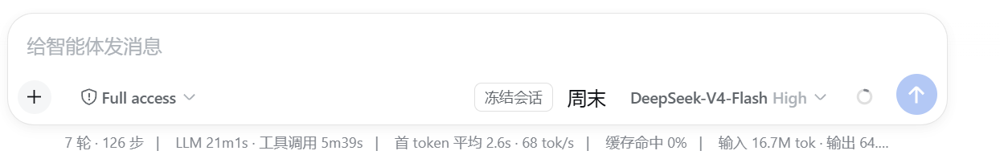

<p align="center">
  <strong>高峰自动会话门：周末模式 + 高峰自动暂停 + 官方源二维判定 + 会话级冻结 + 后端自动重试</strong>
</p>


<p align="center">
  <a href="README.en.md">English</a> · <strong>中文</strong> · <a href="README.ja.md">日本語</a> · <a href="README.ko.md">한국어</a>
</p>
<p align="center">
  <a href="LICENSE"></a>
  
  
</p>

# dsh-session-guard

- [English README](./README.en.md)
- [中文 README](./README.md)
- [日本語 README](./README.ja.md)
- [한국어 README](./README.ko.md)
- [Installation guide](./INSTALL.md)
- [中文安装指南](./INSTALL.zh.md)
- [日本語インストールガイド](./INSTALL.ja.md)
- [한국어 설치 안내](./INSTALL.ko.md)
- [Changelog](./CHANGELOG.md)
- [日本語 changelog](./CHANGELOG.ja.md)
- [한국어 changelog](./CHANGELOG.ko.md)

> **兼容性说明：** v0.1.1 已包含日语（`ja`）和韩语（`ko`）字典，但当前官方 DSH 只通过 `LocaleRuntime` 提供 `zh` 和 `en`。在原版 DSH 中选择 `ja` 或 `ko` 会失败，并提示 `locale "<id>" is not registered`。需要等待官方 DSH 增加对应 locale ID 后才能正常使用。高级用户可以维护 DSH fork 进行扩展。

> **▼ DSH 版本适配**
>
> | DSH 版本 | 加载 | 设置注册 | 会话事件 / 会话门 | 客户端半 |
> | --- | --- | --- | --- | --- |
> | 0.1.0-rc.7 ~ 0.1.1-rc.x | ✅ | `ctx.settings.register(ns, schema, { base })` | ✅ 形状一致 | ✅ 无平台值导入 |
> | 0.1.2-alpha.2+ / 0.1.2-rc.1 | ✅ | `register` 仍保留（另加 `installSection`） | ✅ 形状一致 | ✅ 无平台值导入 |
> | 0.1.3+ / 0.1.5-alpha.1 | 接口仍在（未验证） | `register` 仍在（行号未变） | ✅ | ✅ |
>
> 一份产物同时支持两版本。`session/event`、`agent.cancel`、`goals.pause`、
> `agent.followup`、`commands.register`、`timer.interval`、`webServer.register`、
> `agent/request`、`llm.listConfigurableProviders`、`settings.register/get` 在
> `dsh-v0.1.1-rc.2` 与 `dsh-v0.1.2-rc.1` 之间签名一致（并已核到 `0.1.5-alpha.1`）；
> 唯一需要双读的是 `tool/result` 记录的调用 id 形态（`content[].toolCallId` 优先、
> `source.callId` 回退），已抽到 `src/tool-call-id.js` 并配单测——两版本的回放日志都可能出现这两种形态。
> `model/selection` 事件**仅 0.1.2+**，只做切模型加速且必须特性探测；设置面只用
> `register` + `get` 交集（不碰 `installSection` / 已移除的 `installSettingsSection`）。
> 漂移守卫脚本：`tools/check-api-drift.ps1`（对四个 tag 断言必需接口存在）。

> 高峰时段自动暂停运行中的会话、低峰/周末自动续跑；配合 input-traffic 的冻结按钮做到**会话级**锁定；后端**自动重试**在冻结/门控期间让路。核心基于**自研会话门**（`agent.cancel keepInbox + goals.pause + session/event 安全边界 + followup 续跑`），不再依赖 dsh-task-control。

无需修改 dsh 源码、无需提 PR：`dsh plugin` 命令组装 + bundle patch 装配的 cordis 插件。

> 💡 **为什么推荐**：DeepSeek 已于 2026-08-17 实行**峰谷计费**——高峰时段（北京时间 9:00-12:00、14:00-18:00）单价为闲时（含午间、夜间、周末与节假日）的 **2 倍**。本插件在高峰自动停住运行会话、退峰自动续跑，错峰长跑最多可省 **50%**；手动冻结（配 input-traffic 按钮）可进一步按会话精确控停。

## 功能一览

- **周末模式**：识别周末（基于配置时区 `Intl.DateTimeFormat`，不踩裸 `getUTCDay()` 的北京边界 8 小时 bug）→ 周末无视峰谷、畅快跑。
- **高峰自动暂停（全局）**：进入高峰（且非周末）时，对所有 running root session 自动暂停；退峰自动恢复全部——**全局开关，无需手动**。
- **官方源二维判定（providerGuard）**：高峰期**只在请求目标是 DeepSeek 官方源时**才拦；用本地/第三方 provider（如 `local-35b`）照常跑，不受高峰门影响。判定口径 = 显式 id 名单 → `baseURL` 端点 → catalog 默认端点 → 内置 id。
- **请求级兜底 + 延后队列**：入峰后才启动的会话、会话中途被切到官方源的情况，由 `agent/request` 请求级守卫拦住（默认 `hold`：请求挂起不报错，退峰自动放行）。
- **会话级冻结 / 恢复**：`sessionGuard` 冗余端口 + `POST /session-guard/rpc`，input-traffic 冻结按钮逐会话透传接入；也提供 `/pause /resume /cancel` 手动命令。
- **后端自动重试（D9）**：turn/end 瞬时失败（error/429/max-tokens）自适应退避自动续跑；永久失败停止；**冻结/门控期间让路**，绝不绕过会话门。
- **fail-open**：自研会话门不可用、session-guard 未装、设置服务缺失——均静默降级，绝不因依赖而崩。

## 界面预览

实际运行截屏（Windows，dsh web）——周末模式激活状态：

<figure>
  
  <figcaption>周末模式激活：输入区「周末」徽标高亮，与「冻结会话」并列；周末无视峰谷、会话自动畅跑。</figcaption>
</figure>

## 安装

```bash
dsh plugin --profile web add github:<owner>/dsh-session-guard
```

装后重启 dsh web 并刷新页面。

## 设置（设置 → 插件 → session-guard，简单开关）

| 开关 | 默认 | 说明 |
|---|---|---|
| `enabled` | on | **高峰自动暂停冻结会话**：高峰时段自动暂停运行会话 |
| `providerGuard` | on | **官方源二维判定**：高峰期只拦 DeepSeek 官方源，本地/第三方 provider 照常跑 |
| `guardSubagents` | on | **纳入子代理请求**：子代理请求同样计费，默认一并拦截 |
| `offPeakAutoResume` | on | **低谷自动恢复**：低峰时段自动恢复被暂停的会话；关掉则退峰不自动恢复（需手动） |
| `weekendMode` | on | **周末模式**：识别周末 → 周末不自动暂停（周末本无高峰，畅快跑） |
| `deferredResume` | on | **退峰自动继续**：关闭后延后的请求/会话不自动续跑，需手动 `/resume` |
| `queueFallback` | on | 自研会话门不可用时回退锁等待队列（fail-open） |
| `retryEnabled` | off | **自动重试（后端）**：瞬时失败自动续跑（默认关，保守） |

附属配置：

- `timezone`（默认 Asia/Shanghai）——**周末判定**和徽标显示用的时区；**不影响峰谷判定**（峰谷固定按北京时间）；
- `peakWindows`（默认 09:00–12:00 / 14:00–18:00）——按北京时间（UTC+8）的峰谷窗口，与 DeepSeek 官方计费一致；
- `pauseMode`（`safe`/`force`）、`pauseReason`（`wait`/`stop`）——暂停推进方式；
- 官方源判定：`officialProviders`（追加官方 provider id，逗号分隔，优先级最高）、`officialBaseURLs`（官方端点 host 名单，默认 `api.deepseek.com`）；
- 延后队列：`deferredMode`（`hold` 挂起等待 / `error` 报错并延后）、`deferredResumeText`（退峰续跑文案）、`deferredMaxHoldMs`（挂起上限，默认 6 小时，到期转 error）；
- 重试参数：`retryText`、`retryGraceMs`、`retryCooldownMs`、`retryBackoffFactor`、`retryBackoffMaxMs`、`retryMaxConsecutive`。

## 行为

### 高峰自动门（全局）

- **入峰**（且非周末）：对所有 running root session 调 `gate.stopNextTurn`——自研会话门真暂停（不打断推理，推理完成/工具派发前落在安全边界暂停），或按 `queueFallback` 回退锁等待队列；
- **退峰 / 周末**：`gate.resume` **全部**会话（自动续跑，无需手动）——受 `offPeakAutoResume` 开关控制，关掉则退峰不自动恢复；
- **峰谷时区**：固定使用北京时间（`Asia/Shanghai`），与 DeepSeek 官方计费基准一致，不受 `timezone` 配置影响；
- 状态机：单实例 `NORMAL ↔ PAUSED_PEAK`（`scheduler.js`），由单一 30s tick 驱动。

### 会话锁定（冻结）

- **冗余端口**：`ctx.provide('sessionGuard', service)`——`stopNextTurn(sessionId)` / `resume(sessionId)` / `lockQueue(sessionId)` / `unlockQueue(sessionId)` / `state(sessionId)`；
- **RPC 桥**：`POST /session-guard/rpc { action, sessionId }`——input-traffic 冻结按钮按 `sessionId` **逐会话**调用 `stopNextTurn` / `resume`；本插件未装则静默跳过（D8 fail-open）；
- **手动命令**：`/pause [force|safe] [stop|wait]`、`/resume [confirm] [rerun|skip]`、`/cancel`——作用于调用它的会话（取 `invocation.agent.id`）。

### 后端自动重试（D9）

监听 `turn/end`，将失败分类：

- **瞬时失败**（error/429/max-tokens 等）→ 自适应退避自动 `followup(retryText)` 续跑；
- **永久失败**（鉴权/余额/模型/上下文超限）→ 停止；
- **冻结/门控期间让路**：`isFrozen(sessionId)` 为真（queueLocked / paused / taskControl paused）时不重试；
- 用户介入或成功回合重置连续失败计数。

### 状态徽标（前端展示）

输入区右侧显示一个**纯展示**状态徽标，实时反映当前所处阶段：

| 阶段 | 徽标文案 | CSS 类 | 含义 |
|---|---|---|---|
| `peak`（二维判定开） | 高峰·拦官方 | `sg-peak` | 高峰期，只拦 DeepSeek 官方源请求 |
| `peak`（二维判定关） | 高峰·全部暂停 | `sg-peak` | 高峰期，全部会话暂停 |
| `off-peak` | 谷时 | `sg-off` | 非高峰时段，会话正常运行 |
| `weekend` | 周末 | `sg-weekend` | 周末（周末模式开启时），无视峰谷畅快跑 |

- **轮询**：每 15 秒请求 `GET /session-guard/status`，获取全局 `phase`、`providerGuard`、`held`、`deferred`；
- **fail-open**：路由不可达、网络错误、或 `enabled` 关闭时→ 徽标静默隐藏，不影响任何会话；
- **独立于 input-traffic**：徽标由 session-guard 客户端独立渲染，**不需要安装 input-traffic 插件**即可显示。input-traffic 只负责冻结按钮，与徽标无依赖关系；
- **tooltip**：悬停显示 `阶段 · 时区 · 周末模式 · 判定口径 · 挂起/延后数量`。

### 官方源判定口径（providerGuard）

高峰期**不是无差别停会话**，而是先判断「这次请求真正要去的路由是不是 DeepSeek 官方源」：

| 优先级 | 依据 | `matchedBy` | 例子 |
|---|---|---|---|
| 1 | `officialProviders` 显式 id 名单 | `explicit` | 用户把自建网关声明为官方 |
| 2 | 实时 `baseURL` 归一化后的 host | `endpoint` | `deepseek-official` 改到中转 → **不拦** |
| 3 | catalog 内置默认端点 | `endpoint-default` | pi-ai 的 `deepseek` 路由默认就打官方 API → **拦** |
| 4 | 内置 id 名单（`deepseek-official`） | `route-id` | 读不到端点时的兜底 |
| 5 | 其他 | `unknown` | 非官方，放行 |

- **端点优先于 id**：同名 `deepseek-official` 但把 `baseURL` 指向中转的配置**不会**被误拦；反过来，pi-ai 内置 `deepseek` 路由的默认端点就是官方 API，**不会**被漏拦。
- **端点来源**：`ctx.get('llm').listConfigurableProviders()` 找目录条目 → `ctx.settings.get(settingsNs)` 按 `settingsPath` 读 `baseURL`（只读非密字段，绝不读 `apiKeyEnv` 的值）。每次请求实时算、不缓存 → provider 配置热改立即生效。
- **目标转非官方即恢复**：高峰暂停后把该会话切到本地/第三方 provider（0.1.2+ 的 `model/selection` 事件）→ 自动恢复该会话（受 `deferredResume` 约束）；只恢复本插件因入峰暂停的会话，**不会**碰用户手动 `/pause` 的会话。0.1.1 无该事件 → 退化为「下次请求或手动 `/resume`」。
- **取不到端点**：`llm` 服务缺失、命名空间结构变化、字段非字符串——一律降级为 id / 内置端点判定并记 `matchedBy`，**绝不抛出**。
- **排查误判**：`GET /session-guard/provider?provider=<id>` 返回 `{ official, matchedBy, endpoint }`。

### 请求级守卫与延后队列

- **为什么要请求级**：30s tick 只在 `NORMAL → PAUSED_PEAK` 跳变时处理当时 `running` 的会话；入峰后新启动的会话、会话中途切到官方源的情况都会漏。`agent/request` waterfall 是**每次请求都过**的兜底。
- **判定基于 `next()` 的返回值**：模型选择中间件会在 waterfall 内把 provider/model 覆盖成 UI 里选的值，所以必须先 `await next()` 再判定。
- **hold 模式（默认）**：请求挂起、**不发出也不报错**，退峰瞬间自动放行（`msUntilOffPeak` 精确定时，30s tick 兜底）；用户取消（abort）则正常中断。
- **error 模式**：抛可识别的 `PEAK_DEFERRED` 错误 + 记入延后队列，退峰按 `deferredResumeText` 续跑（`deferredResume` 关闭则不自动继续）。
- **上限保护**：`deferredMaxHoldMs`（默认 6h）到期仍未退峰 → 转 error，避免无限挂起。
- **互斥铁律**：hold 期间**不会**再调会话门暂停（暂停要等安全边界，而请求被挂住就永远到不了安全边界 → 双方互等）。入峰时已挂起的会话会被跳过。
- **不持久化**：延后队列是进程内 promise，重启即消失。

### 边界（明确不做）

- **不换 provider / 不做转接**：只拦不路由；
- **compaction 不走 `agent/request`**：会话被暂停时不会发生压缩；高峰期间若手动触发压缩仍可能打官方源（本插件不拦 `ctx.llm.stream` 层）；
- **0.1.1 没有 `model/selection` 事件**：切到非官方源后的自动恢复退化为「等下一次请求或手动 `/resume`」（0.1.2+ 立即生效）；
- **不新增 npm 依赖**、不读写凭据、不动 `dsh-llm-retry` 的 429 / 传输层重试。

### 时区处理与校验

- 时区判定基于 **IANA 时区名**（如 `Asia/Shanghai`、`Asia/Tokyo`、`Asia/Seoul`），通过 `Intl.DateTimeFormat` 投影为配置时区的墙钟，**不依赖裸 `getUTCDay()`**——避免北京时区 UTC+8 边界错 8 小时的经典 bug（周六 00:30 北京时间，UTC 还是周五）；
- `Intl.DateTimeFormat` 本身即为校验层：传入无效时区名（如 `Foo/Bar`）会抛 `RangeError`，被外层 try-catch 静默降级为默认时区 `Asia/Shanghai`（fail-open）；
- 峰谷窗口为**左闭右开** `[start, end)`，支持跨午夜窗口（如 `22:00–06:00`）；
- `timezone` 配置项对所有语言（中/英/日/韩）通用——`Intl.DateTimeFormat` 的 IANA 时区名不依赖 locale，日文/韩文界面下时区行为与中文完全一致。

### 与 input-traffic 协作

- input-traffic 的**冻结按钮**触发时经 `sessionGuard.stopNextTurn`（RPC，会话级）透传服务端；
- input-traffic **只做冻结增强**（队列冻结/解冻 + composer block），重试归本插件后端；
- 两者共享「会话隔离」语义：input-traffic 冻结队列按 sessionId 隔离，session-guard RPC 同样按 sessionId 锁。

## 冗余端口 `sessionGuard`

```js
{
  stopNextTurn(sessionId, opts),  // 停掉 session 下一回合（自研会话门 / 回退锁队列）
  resume(sessionId, opts),        // 恢复（confirm + choice: rerun|skip）
  lockQueue(sessionId, reason),   // 显式锁队列
  unlockQueue(sessionId),         // 显式解锁
  state(sessionId),               // { queueLocked, lockReason, paused, taskControlAvailable, taskControl }
}
```

## HTTP 路由

- `GET /session-guard/state?session=<id>` — 会话状态（含最近目标 / 是否挂起 / 是否延后）
- `GET /session-guard/settings` — 设置 + taskControl 可用性
- `GET /session-guard/status` — 全局当前阶段（状态徽标轮询）
- `GET /session-guard/provider?provider=<id>` — 官方源判定诊断（`official` / `matchedBy` / `endpoint`）
- `GET /session-guard/diag` — 运行时诊断
- `POST /session-guard/rpc` — `{ action: stopNextTurn|resume|lockQueue|unlockQueue|state, sessionId }`

## 状态存储

每会话 JSON：`$DSH_HOME/.dsh/session-guard/<sessionId>.json`（原子写；`DSH_SESSION_GUARD_STATE_DIR` 可覆盖）。

## 测试

```bash
npm test   # node --test tests/*.test.mjs（时区/周末/状态机/会话门/桥接/重试）
```

## 模块

| 文件 | 职责 |
|---|---|
| `src/time.js` | 高峰/周末判定（时区正确）+ `msUntilOffPeak`（退峰精确定时） |
| `src/scheduler.js` | 纯状态机 NORMAL ↔ PAUSED_PEAK |
| `src/provider.js` | 官方源五级判定（纯函数：端点归一化 + 判定矩阵） |
| `src/provider-directory.js` | 端点目录（`llm.listConfigurableProviders` + `settings.get`，全链路降级） |
| `src/deferrals.js` | 延后登记表（hold 挂起 / 释放 / 超限 / `PeakDeferredError`） |
| `src/request-guard.js` | `agent/request` 请求级守卫（hold / error 两模式） |
| `src/targets.js` | 会话「最近真实目标」追踪（`request/header` + `model/selection`） |
| `src/wiring.js` | 接线编排（入峰过滤 / 退峰释放 / 精确定时 / 卸载清理） |
| `src/pause-gate.js` | 自研会话门引擎（agent.cancel keepInbox + goals.pause + 安全边界 + followup 续跑） |
| `src/pause-store.js` | 自研暂停状态持久化 |
| `src/gate.js` | 会话门驱动（自研真暂停 / 回退锁队列，fail-open） |
| `src/bridge.js` | `sessionGuard` 冗余端口 |
| `src/retry.js` | 后端自动重试（失败分类/退避/冻结让路；只按精确码 `PEAK_DEFERRED` 短路） |
| `src/detect.js` | 自动检测（host taskControl / client input-traffic 桥） |
| `src/store.js` | 每会话持久化状态 |
| `src/settings.js` | 设置子板块（schemastery schema + fail-open 注册） |
| `src/index.js` | host apply（设置/路由/tick/提供服务/重试接线/请求守卫） |
| `src/client/` | 浏览器 half（状态徽标 + 设置卡片 + 四语言字典） |

## License

MIT — 见 [LICENSE](LICENSE)。
